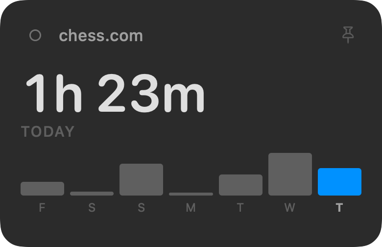
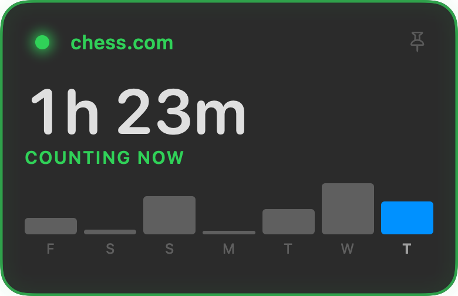

# ChessTime

A small macOS app that tracks how long you spend on chess.com — or any site you
choose — and keeps the total on your desktop like a sticky note.

| Idle | Counting |
| --- | --- |
|  |  |

- **Native and tiny.** SwiftUI + AppKit, no third-party dependencies.
- **Private by construction.** One JSON file on your Mac. No account, no network,
  no analytics.
- **Honest numbers.** The clock only runs while a tracked site is the active tab
  in the frontmost browser, and pauses when you're idle or the screen locks.
- **Obvious when it's running.** The note outlines itself in green, the status
  light pulses, and the label reads COUNTING NOW — so you never have to guess
  whether it noticed.

## Install

Download `ChessTime.dmg` from the [latest release][releases], open it, and drag
ChessTime to Applications.

[releases]: https://github.com/nrimalAI/chess_tracker_macOS/releases/latest

> **If macOS says ChessTime "cannot be opened"** — the build isn't notarized yet.
> Open **System Settings → Privacy & Security**, scroll down to the message about
> ChessTime being blocked, and click **Open Anyway**. Once per install.
>
> On macOS 15 and later, Control-clicking the app no longer works as a shortcut;
> Apple removed that bypass.

## Requirements

macOS 14 or later. Works with Safari, Chrome, Brave, Edge, Arc, Vivaldi and Opera.
Firefox exposes no way for any app to read its tabs, so it can't be tracked.

## Build and run

```bash
brew install xcodegen
xcodegen generate
open ChessTime.xcodeproj
```

Then press ⌘R. Or from the command line:

```bash
xcodegen generate && xcodebuild -project ChessTime.xcodeproj -scheme ChessTime -configuration Debug -derivedDataPath build build && open build/Build/Products/Debug/ChessTime.app
```

Debug builds are ad-hoc signed, so no Apple Developer account is needed.

## Permissions

On first launch ChessTime asks to control each browser you use. This is macOS
**Automation** permission, and the app can't measure anything without it.

It reads exactly one thing: the URL of the active tab. Never page contents, never
history, never other tabs. If you deny it by accident, re-enable it under
System Settings → Privacy & Security → Automation, or use the Permissions tab in
ChessTime's settings.

## Using it

The note starts in the top-right corner. Drag it anywhere; it remembers where you
put it. Right-click for settings.

**Position** decides how the note behaves:

| Mode | Behaviour |
| --- | --- |
| Normal window (default) | Comes to the front when clicked, like a Stickies note. |
| On the desktop | Stays behind your apps. Clicking it still brings it forward, until you switch away. |
| Always on top | Floats above everything, including full-screen apps. |

Clicking the note anywhere brings it forward, as does clicking the Dock icon.

**Pin it.** The pin in the note's top-right corner keeps it above every other app,
so you can watch the clock while working somewhere else. It's dim until you hover
and turns solid blue when pinned. Unpinning returns the note to whichever position
it had before, so a desktop-mode note goes back to the desktop rather than
silently becoming a normal window.

Other settings: opacity, whether to show the week chart, how long you have to be
idle before the clock pauses, opening at login, and hiding the Dock icon.

Add more sites under **Settings → Sites**. Subdomains are included automatically,
so `chess.com` also covers `www.chess.com` and `support.chess.com` — but not
`notchess.com`.

## Where your data lives

```
~/Library/Application Support/ChessTime/usage.json
```

One integer per site per day, in seconds:

```json
{ "2026-07-22": { "chess.com": 4832, "lichess.org": 610 } }
```

Export it as CSV or erase it entirely from **Settings → Data**.

## How it works

Every 5 seconds ChessTime asks macOS which app is frontmost. If it's a known
browser, it sends one Apple Event asking for the active tab's URL, normalises the
host, and credits the elapsed time to that site if you're tracking it.

Sampling means a tab switch can be missed by up to one interval, which nets out to
a few seconds a day — far below the resolution anyone cares about, and much cheaper
than watching every window and tab event in every browser.

The lookup runs on a dedicated background queue, because a busy browser can take
seconds to answer an Apple Event and the UI must never wait on it.

Time does **not** accrue when:

- the frontmost app isn't a browser, or the active tab isn't a tracked site
- you haven't touched the keyboard or mouse for the idle threshold (2 min default)
- the screen is locked, asleep, or showing the screen saver
- the Mac was asleep (elapsed time is clamped to two intervals, so waking up can
  never dump hours onto whatever happens to be in front)

### Why not use macOS Screen Time?

Screen Time tracks apps, not sites, and its database
(`~/Library/Application Support/Knowledge/knowledgeC.db`) refuses to open even for
a read without Full Disk Access. Apple has also been steadily shrinking the
per-domain web usage it keeps there. It isn't a foundation worth building on.

### Why not a browser extension?

It would work, but it means maintaining separate Chrome and Safari extensions, and
neither can draw anything outside the browser — which is the whole point here.

## Testing

Logic tests, no permissions or UI required:

```bash
./Scripts/run_selftest.sh
```

Render the note to a PNG for design review:

```bash
./Scripts/render_preview.sh panel.png
```

## Shipping a build

`Scripts/release.sh` archives, signs, notarizes, staples and packages a DMG:

```bash
TEAM_ID=YOURTEAMID ./Scripts/release.sh
```

This needs paid Apple Developer Program enrollment ($99/yr) for a **Developer ID
Application** certificate, plus a stored notarytool profile:

```bash
xcrun notarytool store-credentials ChessTimeNotary --apple-id you@example.com --team-id YOURTEAMID --password APP_SPECIFIC_PASSWORD
```

Without enrollment the app still builds and runs perfectly on your own Mac, but
anyone you send it to will hit Gatekeeper and have to right-click → Open.

ChessTime targets direct download rather than the Mac App Store: sandboxed apps
need a temporary-exception entitlement to send Apple Events to arbitrary browsers,
and Apple routinely rejects it.

## Project layout

```
Sources/
  App/        ChessTimeApp.swift, AppSettings.swift
  Tracking/   BrowserBridge, HostMatcher, IdleMonitor, Poller
  Data/       UsageStore
  UI/         DesktopPanel, PanelView, SettingsView, OnboardingView
Resources/    Info.plist, entitlements, app icon
Scripts/      selftest, preview renderer, icon generator, release
project.yml   XcodeGen manifest — the .xcodeproj is generated, not committed
```
